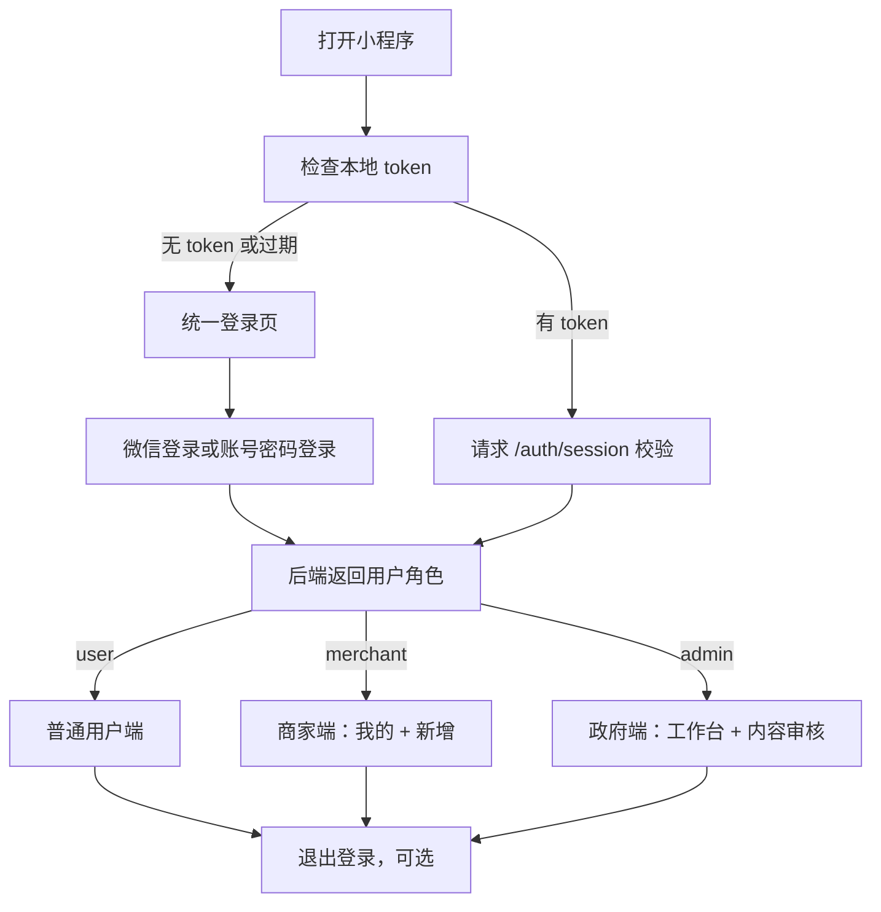
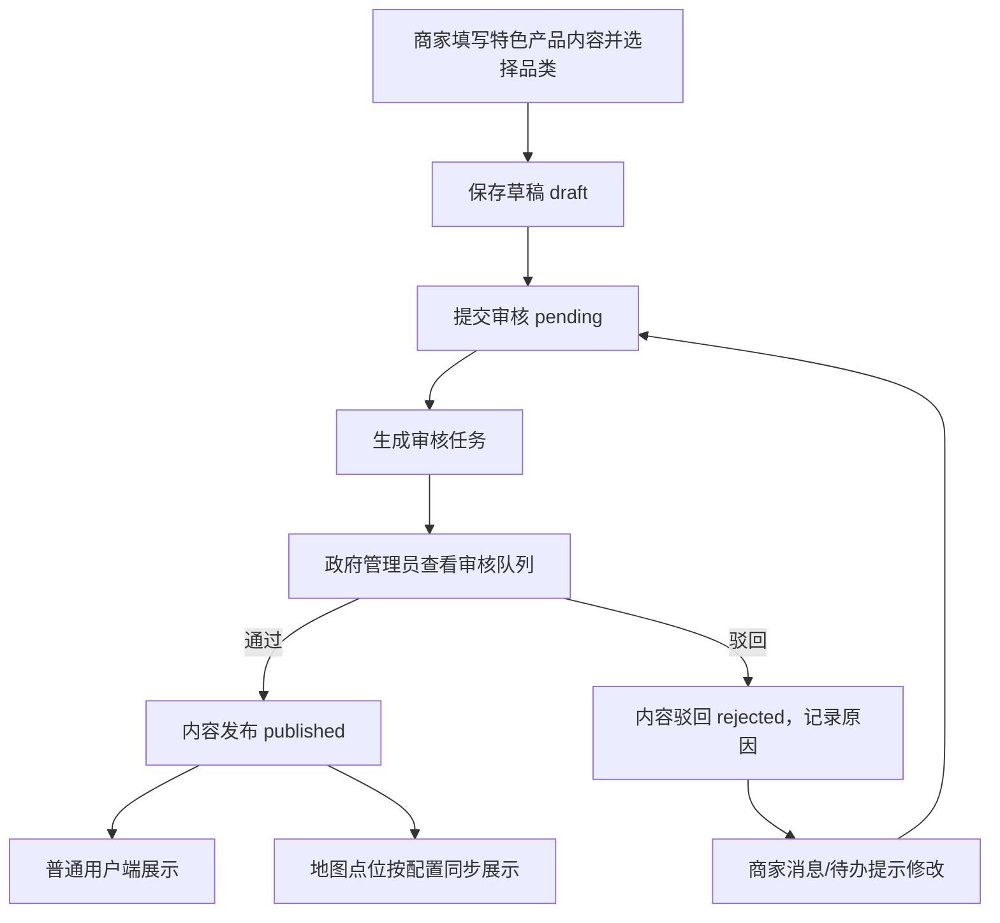

# 黄陂镇特色产业客家文旅非遗小程序_后端 PRD

| 项目 | 内容 |
| --- | --- |
| 文档版本 | v1.1 |
| 更新日期 | 2026-07-14 |
| 适用范围 | 微信小程序统一后端接口、数据模型、权限、审核流程 |
| 关联前端 | `小程序/miniprogram` |
| 核心原则 | 一个小程序、一套后端、登录后由后端返回角色并进入对应前端 |

## 1. 背景与目标

本项目是黄陂镇特色产业、客家文旅和非遗文化的一体化微信小程序。特色产品不是单一油茶业务，油茶与丝苗米均为一级重点品类，后续还需支持传统食品、农副产品、文创伴手礼等其他黄陂特色。前端当前已经调整为单一小程序架构：用户进入统一登录页，后端完成身份认证并返回用户角色，小程序再根据角色进入普通用户端、商家端或政府管理员端。

后端需要支撑以下目标：

| 目标 | 说明 |
| --- | --- |
| 统一登录 | 所有用户先登录，再根据后端返回的 `role` 进入不同前端。 |
| 三角色分流 | 普通用户、商家、政府管理员共用同一小程序，但接口权限隔离。 |
| 多品类产品体系 | 统一管理黄陂特色产品；油茶、丝苗米为同级重点品类，新增其他品类不需要修改审核流程。 |
| 商家内容闭环 | 商家只维护自己的特色产品内容，支持草稿、提交审核、驳回修改、发布展示。 |
| 政府审核闭环 | 政府管理员审核商家资料和商家提交的特色产品内容。 |
| 用户端内容展示 | 登录后的普通用户可浏览首页、特色产品、油茶文化、客家文旅、非遗、地图、活动和个人中心等内容。 |
| 可后期合并扩展 | 当前小程序内管理优先，后续如需要 Web 后台或更细权限，可复用同一后端能力。 |

## 2. 当前产品边界

### 2.1 一期必须做

| 模块 | 范围 |
| --- | --- |
| 登录认证 | 微信登录、账号密码登录、会话校验、退出登录。 |
| 角色路由 | 后端返回 `user / merchant / admin`，前端只按结果跳转，不在前端手动选身份。 |
| 普通用户端 | 首页、搜索、特色产品展示、地图导览、活动展示、活动报名、个人中心基础能力。 |
| 商家端 | 我的页面：消息、待办、统计、退出登录；新增页面：新增/编辑特色产品内容。 |
| 政府端 | 工作台、内容审核、通过、驳回、下架、基础统计。 |
| 内容审核 | 商家资料、商家特色产品内容进入审核队列，审核通过后前台展示。 |
| 文件上传 | 图片上传、图片访问地址返回、文件归属业务记录。 |
| 操作日志 | 登录、提交审核、审核通过、驳回、下架等关键操作记录。 |

### 2.2 一期不做

| 内容 | 说明 |
| --- | --- |
| 商家活动管理 | 商家端不发布活动、不查看活动报名，避免和政府/平台功能混在一起。 |
| 商家订单交易 | 不做在线购买、支付、库存、物流。特色产品只做展示和联系咨询。 |
| 独立 Web 后台 | 当前政府管理端在小程序内完成，后端接口需预留未来 Web 复用能力。 |
| 复杂数据看板 | 一期只做待审核数、已发布数、商家数等基础统计。 |

### 2.3 可二期扩展

| 内容 | 说明 |
| --- | --- |
| 政府端完整内容管理 | 轮播图、路线、地图点位、活动公告可从审核端扩展为完整管理端。 |
| 订阅消息 | 审核结果、报名结果可通过微信订阅消息通知。 |
| 导出 | 报名数据、内容清单、审核记录导出 Excel/CSV。 |
| 更细权限 | 在 `admin` 下细分审核员、内容管理员、超级管理员。 |

### 2.4 特色产品品类原则

- 油茶和丝苗米均为一级重点品类，在首页推荐、产品筛选、搜索和统计中保持同等级别。
- 产品、审核任务和商家权限共用同一套模型与流程，不为油茶或丝苗米分别建立专用业务表。
- 品类由数据库配置，首期至少包含：油茶、丝苗米、客家食品、农副产品、文创伴手礼。
- 禁止只用前端文案判断品类；接口统一返回 `categoryId`、`categoryCode`、`categoryName` 和 `priorityLevel`。

## 3. 用户角色与认证方式

### 3.1 用户角色

| role | 名称 | 进入页面 | 权限边界 |
| --- | --- | --- | --- |
| `user` | 普通用户 | `pages/home/index` | 浏览内容、收藏、活动报名、查看个人信息。 |
| `merchant` | 商家 | `pages/merchant/index` | 管理自己商家的资料和特色产品内容，只能访问自己的数据。 |
| `admin` | 政府管理员 | `pages/admin/index` | 查看工作台、审核商家提交内容、处理通过/驳回/下架。 |

未登录用户只能访问登录页。当前产品逻辑按“强制登录 -> 判断角色 -> 使用对应前端 -> 可选退出登录”执行。

### 3.2 登录方式

| 登录方式 | 适用角色 | 后端处理 |
| --- | --- | --- |
| 微信登录 | 普通用户 `user` | 小程序传 `wx.login` 获取的 `code`，后端调用微信接口换取 `openid`，创建或更新用户。 |
| 账号密码登录 | 商家 `merchant`、政府管理员 `admin` | 后端校验账号、密码哈希、账号状态，返回绑定的角色和商家信息。 |

账号密码登录不允许前端传入角色参数。角色必须来自后端账号记录。

### 3.3 会话返回结构

```json
{
  "token": "jwt-or-session-token",
  "expiresAt": 1783977600000,
  "user": {
    "id": "user_001",
    "nickname": "黄陂特色产品商家",
    "role": "merchant",
    "merchantId": "merchant_001"
  }
}
```

规则：

- `merchantId` 仅商家角色返回。
- `admin` 不返回 `merchantId`。
- token 过期后，接口返回 `401`，前端回到登录页。
- 退出登录后，后端可使 token 失效；前端清除本地缓存。

## 4. 总体业务流程

### 4.1 启动与分流



### 4.2 商家内容审核



## 5. 后端功能需求

### 5.1 认证与会话

| 编号 | 需求 | 优先级 | 验收标准 |
| --- | --- | --- | --- |
| BE-AUTH-001 | 支持微信登录，用 `code` 换取 `openid` 并创建/更新用户。 | 高 | 首次微信登录创建用户，二次登录复用同一用户。 |
| BE-AUTH-002 | 支持账号密码登录，返回商家或政府管理员角色。 | 高 | 正确账号进入对应前端，错误账号返回明确错误。 |
| BE-AUTH-003 | 接口统一校验 token。 | 高 | 未登录访问业务接口返回 `401`。 |
| BE-AUTH-004 | 支持退出登录。 | 中 | 退出后旧 token 不再可用或前端本地会话被清除。 |
| BE-AUTH-005 | 支持账号禁用。 | 高 | 禁用账号无法登录，已登录会话再次校验失败。 |

### 5.2 普通用户能力

| 编号 | 需求 | 优先级 | 验收标准 |
| --- | --- | --- | --- |
| BE-USER-001 | 返回当前用户基础资料。 | 高 | 个人中心可显示昵称、头像、角色。 |
| BE-USER-002 | 支持首页数据聚合。 | 高 | 首页一次获取轮播、重点品类、推荐产品、活动、地图推荐等数据；油茶和丝苗米同级返回。 |
| BE-USER-003 | 支持内容列表与详情。 | 高 | 特色产品、产业文化、文旅、非遗、活动详情可正常展示。 |
| BE-USER-004 | 支持搜索。 | 中 | 按关键词搜索已发布内容。 |
| BE-USER-005 | 支持收藏和取消收藏。 | 中 | 同一用户同一内容不可重复收藏。 |
| BE-USER-006 | 支持活动报名。 | 中 | 用户提交报名后可在个人中心查看记录。 |
| BE-USER-007 | 支持地图点位和路线数据。 | 高 | 地图只展示已发布、未下架的点位。 |

### 5.3 商家端能力

| 编号 | 需求 | 优先级 | 验收标准 |
| --- | --- | --- | --- |
| BE-MER-001 | 返回商家首页统计、消息、待办。 | 高 | 商家“我的”页面能看到待审核、已发布、草稿数量。 |
| BE-MER-002 | 支持商家资料读取和编辑。 | 高 | 商家只能编辑自己的资料。 |
| BE-MER-003 | 支持新增/编辑特色产品内容。 | 高 | 商家可选择启用品类，可保存草稿、提交审核。 |
| BE-MER-004 | 支持上传图片并绑定到内容。 | 高 | 提交内容至少包含标题、分类、简介、封面图。 |
| BE-MER-005 | 支持查看驳回原因。 | 高 | 被驳回内容在商家待办中出现，并展示原因。 |
| BE-MER-006 | 支持商家主动下架自己的已发布内容。 | 中 | 下架后普通用户端和地图不再展示。 |

商家端不得提供活动发布、活动报名查看、政府审核能力。

### 5.4 政府管理员能力

| 编号 | 需求 | 优先级 | 验收标准 |
| --- | --- | --- | --- |
| BE-ADM-001 | 返回政府端工作台统计。 | 高 | 可显示待审核数、今日通过数、商家数等。 |
| BE-ADM-002 | 返回审核队列。 | 高 | 可按待审核、已通过、已驳回筛选。 |
| BE-ADM-003 | 支持审核通过。 | 高 | 通过后内容变为已发布，普通用户端可见。 |
| BE-ADM-004 | 支持审核驳回。 | 高 | 驳回必须填写原因，商家可见。 |
| BE-ADM-005 | 支持下架内容。 | 高 | 下架后普通用户端、地图、搜索均不可见。 |
| BE-ADM-006 | 记录审核操作日志。 | 高 | 每次通过、驳回、下架均有操作者和时间。 |
| BE-ADM-007 | 支持维护产品品类。 | 中 | 可调整品类名称、启用状态、排序和重点等级，不影响历史产品关联。 |

### 5.5 文件与图片

| 编号 | 需求 | 优先级 | 验收标准 |
| --- | --- | --- | --- |
| BE-FILE-001 | 支持图片上传。 | 高 | 返回可被小程序合法域名访问的 HTTPS URL。 |
| BE-FILE-002 | 记录文件业务类型。 | 高 | 可区分商家内容、轮播图、地图点位、活动封面等。 |
| BE-FILE-003 | 限制文件格式和大小。 | 高 | 非图片或超限文件上传失败。 |
| BE-FILE-004 | 支持文件逻辑删除。 | 中 | 删除业务内容时文件不立即物理删除，避免引用断裂。 |

## 6. 内容状态与审核规则

### 6.1 内容状态

| 状态 | 说明 | 前台是否展示 | 商家是否可编辑 |
| --- | --- | --- | --- |
| `draft` | 草稿，未提交审核 | 否 | 是 |
| `pending` | 已提交，等待审核 | 否 | 不建议直接编辑，可撤回后编辑或编辑后重新提交 |
| `published` | 审核通过，已发布 | 是 | 可编辑，但修改后需重新提交审核 |
| `rejected` | 审核驳回 | 否 | 是 |
| `closed` | 已下架 | 否 | 可查看，不建议继续编辑 |

### 6.2 审核规则

- 商家提交资料或内容时，后端创建一条审核任务。
- 同一内容未处理的审核任务只能有一条，避免重复提交。
- 驳回必须填写 `rejectReason`。
- 通过后写入 `publishedAt`，并把内容状态改为 `published`。
- 已发布内容再次修改时，建议生成新版本或把状态回退到 `pending`，避免未审核内容直接覆盖线上内容。
- 下架后，搜索、列表、详情、地图点位都不展示该内容。

## 7. 接口规范

### 7.1 基础约定

| 项目 | 约定 |
| --- | --- |
| 协议 | HTTPS |
| 数据格式 | JSON |
| 鉴权方式 | `Authorization: Bearer <token>` |
| 时间格式 | ISO 8601 字符串或毫秒时间戳，接口需统一 |
| 分页参数 | `page` 从 1 开始，`pageSize` 默认 10，最大 50 |
| 删除方式 | 默认逻辑删除或下架，不做物理删除 |

### 7.2 统一返回格式

```json
{
  "code": 0,
  "message": "success",
  "data": {},
  "traceId": "202607140001"
}
```

分页返回：

```json
{
  "code": 0,
  "message": "success",
  "data": {
    "list": [],
    "page": 1,
    "pageSize": 10,
    "total": 28
  },
  "traceId": "202607140002"
}
```

### 7.3 错误码

| code | 含义 | 场景 |
| --- | --- | --- |
| `0` | 成功 | 正常返回 |
| `40000` | 参数错误 | 缺少必填项、格式错误 |
| `40001` | 手机号格式错误 | 报名或联系信息校验 |
| `40100` | 未登录或 token 过期 | 需要重新登录 |
| `40300` | 无权限 | 访问其他角色接口或其他商家数据 |
| `40400` | 资源不存在 | 内容、商家、审核任务不存在 |
| `40900` | 状态冲突 | 重复提交审核、重复收藏、重复报名 |
| `50000` | 系统错误 | 未预期异常 |

## 8. 核心接口清单

### 8.1 认证接口

| 方法 | 路径 | 权限 | 说明 |
| --- | --- | --- | --- |
| POST | `/api/auth/wechat-login` | 无 | 微信登录，入参 `code`，返回普通用户会话。 |
| POST | `/api/auth/account-login` | 无 | 账号密码登录，返回商家或政府管理员会话。 |
| GET | `/api/auth/session` | 已登录 | 校验当前 token 并返回用户信息。 |
| POST | `/api/auth/logout` | 已登录 | 退出登录，使当前会话失效。 |

### 8.2 普通用户接口

| 方法 | 路径 | 权限 | 说明 |
| --- | --- | --- | --- |
| GET | `/api/me` | 已登录 | 当前用户资料。 |
| GET | `/api/home` | 已登录 | 首页聚合数据。 |
| GET | `/api/search` | 已登录 | 全站搜索，支持 `keyword`、`type`、分页。 |
| GET | `/api/contents` | 已登录 | 内容列表，支持 `type/category/status` 筛选；普通用户只返回已发布。 |
| GET | `/api/contents/{id}` | 已登录 | 内容详情。 |
| GET | `/api/product-categories` | 已登录 | 已启用产品品类；返回重点等级和排序，油茶与丝苗米均为一级重点。 |
| GET | `/api/products` | 已登录 | 已发布特色产品列表，支持 `categoryCode`、关键词和分页。 |
| GET | `/api/products/{id}` | 已登录 | 特色产品详情。 |
| GET | `/api/map/points` | 已登录 | 地图点位列表。 |
| GET | `/api/routes` | 已登录 | 推荐路线列表。 |
| GET | `/api/activities` | 已登录 | 活动列表，活动由平台/政府维护，不由商家发布。 |
| GET | `/api/activities/{id}` | 已登录 | 活动详情。 |
| POST | `/api/activities/{id}/signups` | `user` | 活动报名。 |
| GET | `/api/me/signups` | `user` | 我的报名记录。 |
| GET | `/api/me/favorites` | `user` | 我的收藏。 |
| POST | `/api/favorites` | `user` | 收藏内容。 |
| DELETE | `/api/favorites/{id}` | `user` | 取消收藏。 |

### 8.3 商家接口

| 方法 | 路径 | 权限 | 说明 |
| --- | --- | --- | --- |
| GET | `/api/merchant/dashboard` | `merchant` | 商家“我的”页统计、消息、待办。 |
| GET | `/api/merchant/profile` | `merchant` | 当前商家资料。 |
| PATCH | `/api/merchant/profile` | `merchant` | 保存商家资料草稿。 |
| POST | `/api/merchant/profile/submit` | `merchant` | 提交商家资料审核。 |
| GET | `/api/merchant/products` | `merchant` | 当前商家的特色产品列表。 |
| POST | `/api/merchant/products` | `merchant` | 新增特色产品，必须提交有效的 `categoryId`。 |
| GET | `/api/merchant/products/{id}` | `merchant` | 查看自己的内容详情。 |
| PATCH | `/api/merchant/products/{id}` | `merchant` | 编辑自己的内容。 |
| POST | `/api/merchant/products/{id}/submit` | `merchant` | 提交审核。 |
| POST | `/api/merchant/products/{id}/close` | `merchant` | 下架自己的已发布内容。 |
| GET | `/api/merchant/messages` | `merchant` | 商家消息。 |
| GET | `/api/merchant/todos` | `merchant` | 商家待办。 |

### 8.4 政府管理员接口

| 方法 | 路径 | 权限 | 说明 |
| --- | --- | --- | --- |
| GET | `/api/admin/dashboard` | `admin` | 工作台统计。 |
| GET | `/api/admin/reviews` | `admin` | 审核列表，支持状态和类型筛选。 |
| GET | `/api/admin/reviews/{id}` | `admin` | 审核详情。 |
| POST | `/api/admin/reviews/{id}/approve` | `admin` | 审核通过。 |
| POST | `/api/admin/reviews/{id}/reject` | `admin` | 审核驳回，必须传原因。 |
| POST | `/api/admin/reviews/{id}/close` | `admin` | 下架已发布内容。 |
| GET | `/api/admin/merchants` | `admin` | 商家列表，供统计和后续管理使用。 |
| GET | `/api/admin/product-categories` | `admin` | 产品品类列表，包括停用品类。 |
| POST | `/api/admin/product-categories` | `admin` | 新增产品品类。 |
| PATCH | `/api/admin/product-categories/{id}` | `admin` | 修改品类名称、排序、重点等级和启用状态。 |
| GET | `/api/admin/audit-logs` | `admin` | 操作日志查询。 |

### 8.5 文件接口

| 方法 | 路径 | 权限 | 说明 |
| --- | --- | --- | --- |
| POST | `/api/files` | `merchant/admin` | 上传图片，返回 `fileId` 和 `url`。 |
| GET | `/api/files/{id}` | 已登录 | 文件信息。 |
| DELETE | `/api/files/{id}` | 上传者或 `admin` | 逻辑删除文件。 |

## 9. 数据模型

### 9.1 `users` 用户表

| 字段 | 类型 | 说明 |
| --- | --- | --- |
| `id` | bigint/string | 用户 ID |
| `openid` | varchar | 微信 openid，普通用户必填 |
| `unionid` | varchar | 可选 |
| `nickname` | varchar | 昵称 |
| `avatar_url` | varchar | 头像 |
| `phone` | varchar | 手机号，可选 |
| `role` | enum | `user / merchant / admin` |
| `status` | enum | `enabled / disabled` |
| `last_login_at` | datetime | 最近登录时间 |
| `created_at` | datetime | 创建时间 |
| `updated_at` | datetime | 更新时间 |

### 9.2 `account_users` 账号密码表

| 字段 | 类型 | 说明 |
| --- | --- | --- |
| `id` | bigint/string | 账号 ID |
| `username` | varchar | 登录账号，唯一 |
| `password_hash` | varchar | 密码哈希 |
| `role` | enum | `merchant / admin` |
| `user_id` | bigint/string | 关联用户 ID |
| `merchant_id` | bigint/string | 商家账号绑定商家 |
| `status` | enum | `enabled / disabled` |
| `last_login_at` | datetime | 最近登录时间 |
| `created_at` | datetime | 创建时间 |

### 9.3 `merchants` 商家表

| 字段 | 类型 | 说明 |
| --- | --- | --- |
| `id` | bigint/string | 商家 ID |
| `name` | varchar | 商家名称 |
| `owner_name` | varchar | 负责人 |
| `phone` | varchar | 联系电话 |
| `address` | varchar | 地址 |
| `latitude` | decimal | 纬度 |
| `longitude` | decimal | 经度 |
| `business_hours` | varchar | 营业时间 |
| `intro` | text | 商家简介 |
| `cover_file_id` | bigint/string | 商家图片 |
| `status` | enum | `draft / pending / published / rejected / closed` |
| `reject_reason` | varchar/text | 驳回原因 |
| `created_at` | datetime | 创建时间 |
| `updated_at` | datetime | 更新时间 |

### 9.4 `product_categories` 产品品类表

| 字段 | 类型 | 说明 |
| --- | --- | --- |
| `id` | bigint/string | 品类 ID |
| `code` | varchar unique | 稳定业务编码，如 `oil_tea`、`simiao_rice` |
| `name` | varchar | 展示名称 |
| `priority_level` | tinyint | 重点等级；数值越小优先级越高，油茶和丝苗米首期均为 `1` |
| `sort` | int | 同等级内展示顺序 |
| `status` | enum | `enabled / disabled` |
| `created_at` | datetime | 创建时间 |
| `updated_at` | datetime | 更新时间 |

首期初始化数据：

| code | name | priority_level |
| --- | --- | --- |
| `oil_tea` | 油茶 | `1` |
| `simiao_rice` | 丝苗米 | `1` |
| `hakka_food` | 客家食品 | `2` |
| `agricultural_product` | 农副产品 | `2` |
| `cultural_creative` | 文创伴手礼 | `2` |

### 9.5 `merchant_products` 商家特色产品表

| 字段 | 类型 | 说明 |
| --- | --- | --- |
| `id` | bigint/string | 内容 ID |
| `merchant_id` | bigint/string | 所属商家 |
| `title` | varchar | 产品名称 |
| `category_id` | bigint/string | 关联 `product_categories.id`，不直接保存品类名称 |
| `summary` | varchar | 简介 |
| `content` | text | 详情 |
| `cover_file_id` | bigint/string | 封面图 |
| `image_file_ids` | json | 详情图片 |
| `address` | varchar | 地址 |
| `latitude` | decimal | 纬度 |
| `longitude` | decimal | 经度 |
| `contact_phone` | varchar | 联系方式 |
| `business_hours` | varchar | 营业时间 |
| `status` | enum | `draft / pending / published / rejected / closed` |
| `reject_reason` | varchar/text | 驳回原因 |
| `view_count` | int | 浏览量 |
| `published_at` | datetime | 发布时间 |
| `created_at` | datetime | 创建时间 |
| `updated_at` | datetime | 更新时间 |

### 9.6 `review_tasks` 审核任务表

| 字段 | 类型 | 说明 |
| --- | --- | --- |
| `id` | bigint/string | 审核任务 ID |
| `target_type` | enum | `merchant_profile / merchant_product` |
| `target_id` | bigint/string | 被审核对象 ID |
| `merchant_id` | bigint/string | 所属商家 |
| `submitter_user_id` | bigint/string | 提交人 |
| `status` | enum | `pending / approved / rejected / closed` |
| `reviewer_user_id` | bigint/string | 审核人 |
| `review_comment` | varchar/text | 审核意见或驳回原因 |
| `submitted_at` | datetime | 提交时间 |
| `reviewed_at` | datetime | 审核时间 |
| `created_at` | datetime | 创建时间 |

### 9.7 `content_items` 平台内容表

用于政府/平台维护的特色产业文化、文旅资源、非遗项目、活动公告等非商家内容。油茶文化和丝苗米种植文化均归入产业内容，不把油茶写死为唯一产业类型。

| 字段 | 类型 | 说明 |
| --- | --- | --- |
| `id` | bigint/string | 内容 ID |
| `type` | enum | `industry / culture / intangible / activity / notice` |
| `category_id` | bigint/string | 产业内容可关联产品品类，其他类型可为空 |
| `category` | varchar | 文旅、非遗等非产品分类，可选 |
| `title` | varchar | 标题 |
| `summary` | varchar | 摘要 |
| `content` | text | 正文 |
| `cover_file_id` | bigint/string | 封面图 |
| `image_file_ids` | json | 图集 |
| `address` | varchar | 地址，可选 |
| `contact_phone` | varchar | 联系方式，可选 |
| `start_at` | datetime | 活动开始时间，可选 |
| `end_at` | datetime | 活动结束时间，可选 |
| `signup_limit` | int | 活动报名上限，可选 |
| `status` | enum | `draft / published / closed` |
| `sort` | int | 排序 |
| `created_at` | datetime | 创建时间 |
| `updated_at` | datetime | 更新时间 |

### 9.7 其他核心表

| 表名 | 用途 | 关键字段 |
| --- | --- | --- |
| `file_assets` | 文件素材 | `id, url, file_name, mime_type, size, biz_type, uploader_user_id, status, created_at` |
| `favorites` | 用户收藏 | `id, user_id, target_type, target_id, created_at` |
| `activity_signups` | 活动报名 | `id, activity_id, user_id, name, phone, people_count, remark, status, created_at` |
| `banners` | 首页轮播 | `id, title, image_file_id, link_type, link_target, sort, status` |
| `map_points` | 地图点位 | `id, title, type, address, latitude, longitude, cover_file_id, related_type, related_id, status` |
| `routes` | 推荐路线 | `id, title, summary, cover_file_id, duration_text, status, sort` |
| `route_points` | 路线点位 | `id, route_id, point_id, sort` |
| `messages` | 站内消息 | `id, receiver_user_id, type, title, content, read_at, created_at` |
| `audit_logs` | 操作日志 | `id, actor_user_id, action, target_type, target_id, detail_json, ip, created_at` |

## 10. 权限控制

| 接口/能力 | user | merchant | admin |
| --- | --- | --- | --- |
| 登录后浏览普通内容 | 允许 | 可选允许 | 可选允许 |
| 收藏/报名 | 允许 | 不作为商家端重点 | 不作为政府端重点 |
| 查看商家工作台 | 不允许 | 允许自己的商家 | 不允许 |
| 新增/编辑商家产品 | 不允许 | 允许自己的商家 | 不允许 |
| 提交审核 | 不允许 | 允许自己的内容 | 不允许 |
| 查看审核队列 | 不允许 | 只能看自己的结果 | 允许全部 |
| 审核通过/驳回/下架 | 不允许 | 不允许 | 允许 |
| 查看操作日志 | 不允许 | 不允许 | 允许 |

后端必须以 token 中的用户身份和数据库权限为准，不信任前端传入的 `userId`、`role`、`merchantId`。

## 11. 数据校验规则

| 对象 | 校验规则 |
| --- | --- |
| 账号密码登录 | 账号存在、密码正确、账号启用、角色为 `merchant/admin`。 |
| 商家资料 | 商家名称、联系电话、地址为必填；手机号格式校验。 |
| 商家产品 | 标题、有效品类、简介、至少一张图片为必填；停用品类不可用于新建或重新提交。 |
| 图片上传 | 仅允许 jpg/jpeg/png/webp；单图建议不超过 5MB。 |
| 审核驳回 | 驳回原因必填，长度建议 5-200 字。 |
| 活动报名 | 姓名、手机号、报名人数必填；人数必须为正整数。 |
| 收藏 | 同一用户、同一对象只能收藏一次。 |
| 地图点位 | 经纬度必须在合法范围；缺失坐标时不得进入地图展示。 |

## 12. 安全与合规

| 编号 | 需求 | 验收标准 |
| --- | --- | --- |
| BE-SEC-001 | 密码使用 bcrypt、argon2 等安全哈希，不存明文。 | 数据库无明文密码。 |
| BE-SEC-002 | 所有业务接口必须校验登录态。 | 未登录访问返回 `401`。 |
| BE-SEC-003 | 所有角色接口必须校验权限。 | 商家不能访问其他商家数据，普通用户不能访问管理接口。 |
| BE-SEC-004 | 接口做参数校验和转义。 | 防止 SQL 注入、XSS、非法文件上传。 |
| BE-SEC-005 | 重要操作写日志。 | 登录、提交、审核、下架、删除均可追溯。 |
| BE-SEC-006 | 用户隐私字段最小化展示。 | 手机号等敏感信息不向无权限用户公开。 |
| BE-SEC-007 | 正式环境只允许 HTTPS。 | 小程序合法域名配置通过。 |

## 13. 非功能需求

| 类别 | 指标 |
| --- | --- |
| 性能 | 常规列表接口 P95 响应时间不超过 500ms；详情接口 P95 不超过 800ms。 |
| 可用性 | 正式环境可用性目标 99%。 |
| 兼容性 | 支持微信小程序基础库当前版本及近两个稳定版本。 |
| 日志 | 每个请求生成 `traceId`，错误日志可按 `traceId` 查询。 |
| 备份 | 数据库每日备份，保留至少 7 天；重要上线前手动备份。 |
| 扩展性 | 接口路径和权限设计可被未来 Web 管理端复用。 |

## 14. 部署环境

| 环境 | 用途 | 说明 |
| --- | --- | --- |
| dev | 本地/联调 | 可使用测试微信 AppId、测试对象存储。 |
| test | 验收测试 | 接近生产配置，供小程序体验版联调。 |
| prod | 正式上线 | HTTPS 域名、正式数据库、正式对象存储。 |

建议环境变量：

| 变量 | 说明 |
| --- | --- |
| `WECHAT_APP_ID` | 微信小程序 AppId |
| `WECHAT_APP_SECRET` | 微信小程序 AppSecret |
| `JWT_SECRET` | token 签名密钥 |
| `DB_URL` | 数据库连接 |
| `OBJECT_STORAGE_BUCKET` | 对象存储桶 |
| `OBJECT_STORAGE_CDN_DOMAIN` | 文件访问域名 |

## 15. 验收清单

| 场景 | 验收标准 |
| --- | --- |
| 微信登录 | 普通用户登录后进入首页，接口返回 `role=user`。 |
| 商家登录 | 商家账号登录后进入商家“我的”，接口返回 `role=merchant` 和 `merchantId`。 |
| 政府登录 | 政府账号登录后进入政府工作台，接口返回 `role=admin`。 |
| 强制登录 | 清空 token 后访问业务页，应回到登录页。 |
| 商家新增 | 商家新增特色产品并提交后，政府审核队列出现记录。 |
| 重点品类 | 油茶和丝苗米均能新增、筛选、推荐和审核，接口返回相同 `priorityLevel=1`。 |
| 审核通过 | 政府通过后，普通用户特色产品列表可看到该内容。 |
| 审核驳回 | 政府驳回后，商家待办出现驳回原因。 |
| 数据隔离 | A 商家无法查看或修改 B 商家的内容。 |
| 下架 | 内容下架后，列表、搜索、详情、地图均不展示。 |
| 退出登录 | 退出后重新进入需要再次登录。 |

## 16. 待确认问题

| 问题 | 建议 |
| --- | --- |
| 是否所有普通浏览也必须登录 | 当前按强制登录执行；如后续要开放游客浏览，需要调整登录守卫和接口权限。 |
| 活动是否由政府端一期维护 | 当前不允许商家管理活动；若活动需要后台维护，建议归政府管理员，不进入商家端。 |
| 地图坐标来源 | 一期可手填坐标；二期接入地理编码服务自动生成。 |
| 微信手机号授权 | 一期可不强制；活动报名时用户手填手机号并做隐私提示。 |
| 审核版本策略 | 简化可直接覆盖草稿；正式上线建议保留线上版本和待审核版本，避免未审核修改影响已发布内容。 |
